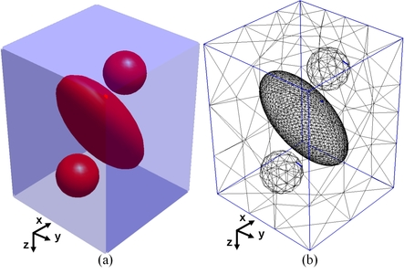
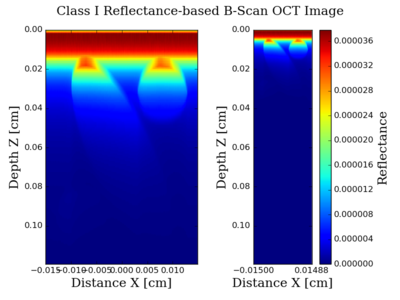
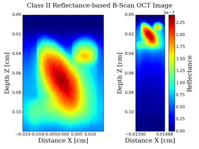

 

  

# Massively Parallel Simulator of Optical Coherence Tomography of Inhomogeneous Turbid Media
OCT-MPS is a massively parallel simulator of optical coherence tomography (OCT) of inhomogeneous turbid media that obtains both Class I diffusive reflectance, due to ballistic and quasi-ballistic scattered photons, and Class II diffusive reflectance due to multiple scattered photons. This Monte Carlo-based simulator is implemented on graphic processing units (GPUs) to exploit the parallel nature of propagation of photons in tissue. It models an arbitrary shaped object as a tetrahedron-based mesh and uses an advanced importance sampling scheme. This new simulator speeds up simulations of OCT of inhomogeneous turbid media by at least one order of magnitude, therefore it is considerably more practical to use than its central processing unit (CPU)-based counterpart. 

## Usage
To use the OCT-MPS you should pass the opt input json file, containing optical properties of regions, the mesh file (.mesh) 
and the bias json file as the input to the program as follows:
```
python ./src/python/octmps_main.py --input-opt-json-file <optical parameters json file> \
                                    --input-bias-json-file <bias parameters json file> \
                                    --input-mesh-file <.mesh file> --visualize                                                                                                         
```

### Example
```
python ./src/python/octmps_main.py \
                   --input-opt-json-file ./data/input/ellipsoid_and_two_spheres/input_opt.json \
                   --input-bias-json-file ./data/input/ellipsoid_and_two_spheres/input_bias.json \
                   --input-mesh-file ./data/input/ellipsoid_and_two_spheres/ellipsoid_and_two_spheres_60_degree.mesh \
                   --visualize
```

## Generating Mesh File
To generate OCT-MPS input mesh file, you can use [Netgen](https://ngsolve.org/). 
First you need to install Netgen. Once Netgen is installed you can create mesh file
using the python script in utils/mesh_generator.py. 

###Example:
```
python3 mesh_generator.py --geo_file=../../input/wang_bump/wang_bump.geo --output_mesh_file=test.mesh
```

## Authors
Siavash Malektaji,
Ivan T. Lima Jr.,
Mauricio R. Escobar I.,
Sherif S. Sherif

## License
See [LICENSE](LICENSE).


## References

If you use this software in a scientific publication, please cite the following papers:

[Siavash Malektaji, Ivan T. Lima, Sherif S. Sherif, "Monte Carlo simulation of optical coherence tomography for turbid media with arbitrary spatial distributions," J. Biomed. Opt. 19(4) 046001 (2 April 2014)](https://www.spiedigitallibrary.org/journals/Journal-of-Biomedical-Optics/volume-19/issue-4/046001/Monte-Carlo-simulation-of-optical-coherence-tomography-for-turbid-media/10.1117/1.JBO.19.4.046001.full)

[Siavash Malektaji, Ivan T. Lima, Mauricio R.Escobar I, Sherif S.Sherif, "Massively parallel simulator of optical coherence tomography of inhomogeneous turbid media," Computer Methods and Programs in Biomedicine, Volume 150, 2017, Pages 97-105](https://www.sciencedirect.com/science/article/pii/S0169260716303091)

OCTMPS is witten based on the following papers/codes:

[1] (MCML) L.-H. Wang, S. L. Jacques, and L.-Q. Zheng, "MCML - Monte Carlo modeling of photon 
    transport in multi-layered tissues\", Computer Methods and Programs in Biomedicine, 47,131-146, 1995.

[2] (TIM-OS) H. Shen and G. Wang. "Tetrahedron-based inhomogeneous Monte-Carlo optical simulator." Phys. Med. Biol. 55:947-962, 
    2010.

[3] (CUDAMCML) Alerstam, Erik, Tomas Svensson, and Stefan Andersson-Engels. "Parallel computing with
    graphics processing units for high-speed Monte Carlo simulation of photon migration.
    Journal of biomedical optics 13.6 (2008): 060504-060504.
